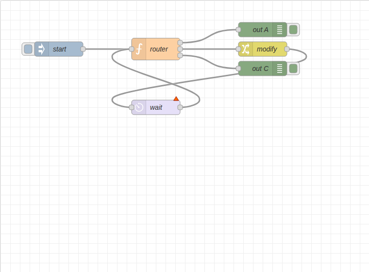
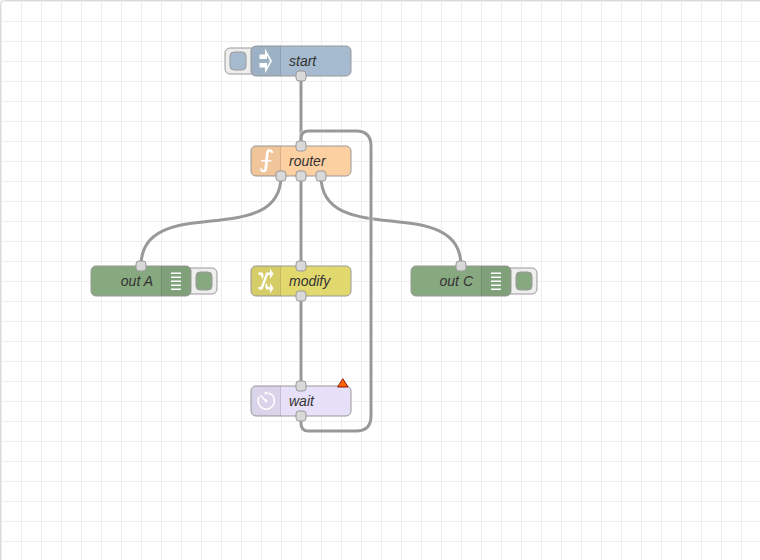
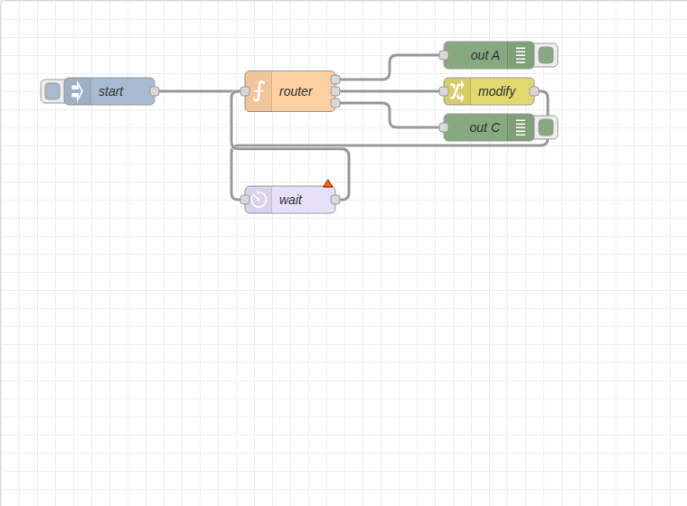
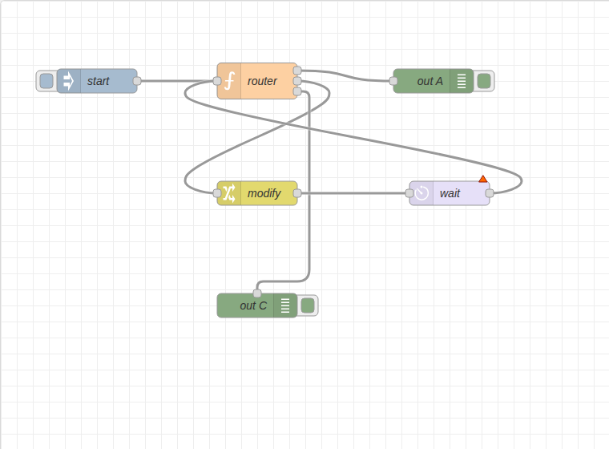
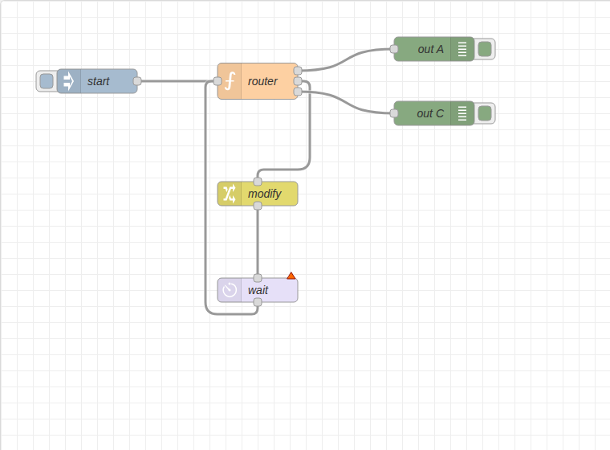
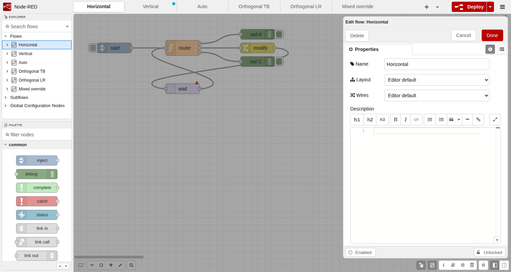
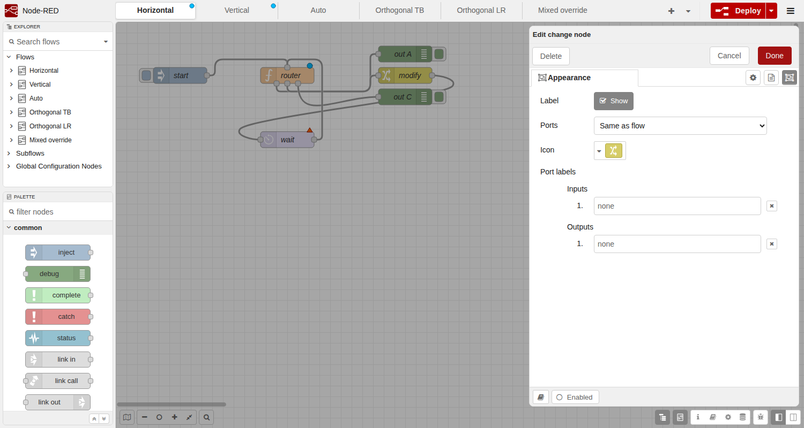

# Układ flow i routing linii – dokumentacja

> **Autorstwo:** rozwiązanie opracowała firma **Actuna Sp. z o.o.** w osobie **Wojciecha Repińskiego** (developer), z użyciem narzędzi AI.

Znane problemy i plan prac: [BACKLOG.md](BACKLOG.md).

Edytor Node-RED pozwala wybrać, jak rysowane są węzły i łączące je linie:

| Układ | Wejście | Wyjścia | Zastosowanie |
|---|---|---|---|
| **Lewo → prawo** (`LR`, domyślny) | lewa krawędź | prawa krawędź | klasyczny Node-RED |
| **Góra → dół** (`TB`) | górna krawędź | dolna krawędź | procesy sekwencyjne, drzewa decyzyjne |
| **Automatyczny** (`auto`) | zależnie od położenia połączonych węzłów | | flow mieszane |

oraz styl linii:

| Styl | Opis |
|---|---|
| **Krzywe** (`curved`, domyślny) | gładkie krzywe Béziera – w LR identyczne jak dotychczas |
| **Kąty proste** (`orthogonal`) | odcinki poziome i pionowe z zaokrąglonymi narożnikami, omijające węzły na końcach linii |

| Lewo → prawo | Góra → dół |
|---|---|
|  |  |
| **Kąty proste, lewo → prawo** | **Kąty proste, góra → dół** |
|  |  |
| **Automatyczny** | **Orientacja ustawiona dla pojedynczych węzłów** |
|  |  |

## Nagranie demonstracyjne

[`node-red-flow-layout-demo.mp4`](node-red-flow-layout-demo.mp4) (ok. 60 s) pokazuje:
zmianę układu flow na góra → dół, linię wstecz omijającą węzły, styl „kąty proste”,
przeciąganie nowej linii, zmianę orientacji pojedynczego węzła z menu kontekstowego,
tryb automatyczny przy przesuwaniu węzła oraz ustawienia domyślne edytora.

Nagranie można odtworzyć skryptem [`demo/record-demo.js`](demo/record-demo.js)
na flow [`demo/demo-flows.json`](demo/demo-flows.json) (instrukcja w nagłówku skryptu).

## Włączenie (`editorTheme.flowLayout.enabled`, Z-14)

Kontrolki układu są dostępne po włączeniu w `settings.js`:

```js
editorTheme: {
    flowLayout: { enabled: true }
}
```

Domyślnie (`false`, brak obiektu lub wartość inna niż `true`) edytor wygląda jak w 5.0.7: brak pól
„Layout”/„Wires” we właściwościach flow i wyglądzie subflow, brak „Ports” w wyglądzie węzła, brak sekcji
„Flow layout” w ustawieniach użytkownika, brak pozycji menu kontekstowego i akcji `core:*-node-ports*`.
Przy wyłączonym ustawieniu (decyzja R-01):
- flow z zapisanym `layout`/`wireStyle`/`o` **rysują się zgodnie z danymi**, a dane są zachowywane przy
  edycji, eksporcie, deployu i w Admin API;
- ustawienia użytkownika `view-flow-layout`/`view-wire-style` są **ignorowane** (układ domyślny `LR`/`curved`),
  ale nie są usuwane; eksport i deploy nie dopisują wartości domyślnych użytkownika (FL-B-009);
- części runtime (`diffNodes`, API pojedynczego flow) działają zawsze (R-02).

Ustawienie trafia do edytora przez `editor-api/lib/editor/theme.js` (`RED.settings.theme("flowLayout.enabled")`);
w edytorze sprawdza je `RED.viewLayout.isEnabled()` / `RED.view.layout.isEnabled()`.

## Gdzie ustawić

Ustawienia działają hierarchicznie – bardziej szczegółowe wygrywa:

**węzeł → flow (zakładka lub subflow) → ustawienia użytkownika → lewo → prawo**

### Domyślnie dla edytora (ustawienia użytkownika)

Menu → *Settings* → zakładka *View* → sekcja **Flow layout**:
- **Layout** – domyślny układ flow, które nie mają własnego,
- **Wires** – domyślny styl linii.

Ustawienie jest zapisywane per użytkownik (`editor.view["view-flow-layout"]`,
`editor.view["view-wire-style"]`). Samo ustawienie nie zmienia flow, ale przy eksporcie
i deployu flow bez własnych wartości dostaje wartość efektywną, jeśli różni się od
domyślnej (`LR`, `curved`) – zob. „Eksport, import i przenoszalność” (FL-B-009).

### Dla jednego flow (zakładki)

Dwuklik na zakładce (lub *Edit flow*) → **Properties**:
- **Layout** – *Editor default* / *Left to right* / *Top to bottom* / *Automatic (mixed)*,
- **Wires** – *Editor default* / *Curved* / *Right angles*.



Ustawienie jest zapisywane w flow (`layout`, `wireStyle` na obiekcie `tab`), więc
widzą je wszyscy użytkownicy i trafia do eksportu.

### Dla subflow

Edycja subflow → zakładka **Appearance** → pola **Layout** i **Wires** (układ
wewnątrz subflow).

### Dla pojedynczego węzła

- Edycja węzła → zakładka **Appearance** → **Ports**: *Same as flow* / *Left to right* / *Top to bottom*,
- lub menu kontekstowe na zaznaczonych węzłach → *Node* → *Ports: left to right* /
  *Ports: top to bottom* / *Ports: same as flow*,
- lub akcje (lista akcji `Ctrl/Cmd+Shift+P`, można też przypisać skróty):
  `core:set-selected-node-ports-horizontal`, `core:set-selected-node-ports-vertical`,
  `core:reset-selected-node-ports`.



Wszystkie zmiany można cofnąć (*Undo*).

## Zachowanie szczegółowe

- **Rozmiar węzła w układzie góra → dół** – wysokość jest stała, szerokość rośnie,
  gdy węzeł ma dużo wyjść (rozstaw portów 20px).
- **Status węzła** w układzie góra → dół jest wyświetlany z prawej strony węzła
  (pod węzłem są wyjścia).
- **Linie wstecz** (np. pętla z powrotem do wcześniejszego węzła) są prowadzone
  dookoła węzłów zamiast przez nie.
- **Tryb automatyczny** – każda linia „głosuje”: bardziej pionowa → góra‑dół,
  bardziej pozioma → lewo‑prawo; o orientacji węzła decyduje większość jego linii
  (remis → lewo‑prawo). Podczas przeciągania węzłów orientacje są zamrożone, a
  przeliczane po upuszczeniu. Gdy heurystyka nie pasuje, ustaw orientację węzła ręcznie.
- **Szybkie dodawanie** (przeciągnięcie linii w puste miejsce + wybór typu) w
  układzie góra → dół dodaje kolejne węzły poniżej.
- **Linki do innych zakładek** (`link out`/`link in`) w układzie góra → dół
  wychodzą z dołu / wchodzą od góry; nazwy zakładek są poziome, jedna pod drugą (FL-B-008).
- **Podpowiedzi etykiet portów** w układzie góra → dół – nad wejściem i pod wyjściami (FL-B-007).
- **Deploy** – zmiana układu jest wyłącznie wizualna: deploy „Modified nodes”
  nie restartuje węzłów z jej powodu.
- **Zgodność** – flow bez ustawionych właściwości eksportują się bez zmian.
  Starsze wersje Node-RED ignorują `layout`, `wireStyle` i `o` (rysują układ lewo‑prawo).

## Eksport, import i przenoszalność

Układ jest częścią flow, więc przenosi się razem z nim:

| Operacja | Co jest przenoszone |
|---|---|
| Eksport → *bieżący flow* | zakładka z `layout`/`wireStyle` oraz `o` węzłów |
| Eksport → *wszystkie flow* | jw. dla wszystkich zakładek i subflow |
| Eksport → *zaznaczone węzły*, kopiuj/wklej | tylko `o` węzłów (zakładka nie jest częścią zaznaczenia); węzły bez `o` przyjmują układ flow, do którego zostały wklejone |
| Subflow użyty przez eksportowane węzły | definicja subflow z `layout`/`wireStyle` |
| Import (okno *Import*, plik, biblioteka) | wszystkie powyższe właściwości; nowy flow rysuje się w zapisanym układzie |
| Deploy / zapis do pliku flow | wszystkie właściwości |
| Admin API: `POST /flow`, `GET /flow/:id`, `PUT /flow/:id`, `GET`/`POST /flows` | `layout`/`wireStyle` zakładki oraz `o` węzłów |

Uwagi:
- przy imporcie subflow identycznego z już istniejącym Node-RED używa istniejącego;
  subflow różniący się tylko układem jest traktowany jako inny subflow,
- flow (zakładka, subflow) bez własnego `layout`/`wireStyle` jest eksportowany i wdrażany
  z wartością efektywną z ustawień użytkownika (Settings → View), jeśli różni się ona od
  domyślnej (`LR`, `curved`) – dzięki temu wygląda tak samo u innego użytkownika i na innej
  instancji (FL-B-009, decyzja B-01). Flow korzystające z wartości domyślnych eksportują się
  bez nowych pól. Po deployu zapisana wartość staje się własną wartością flow (tak jak po
  ponownym wczytaniu edytora). Kopiowanie węzłów (Ctrl+C) i porównanie zmian (*Review changes*)
  nie dopisują wartości domyślnych,
- starsze wersje Node-RED wczytają taki flow poprawnie (w układzie lewo → prawo),
  ale przy ponownym eksporcie z nich właściwości układu zostaną pominięte.

## Format w pliku flow

```json
[
  { "id": "f1", "type": "tab", "label": "Proces", "layout": "TB", "wireStyle": "orthogonal" },
  { "id": "n1", "type": "function", "z": "f1", "o": "LR", "x": 200, "y": 100, "wires": [[]] },
  { "id": "s1", "type": "subflow", "name": "Moduł", "layout": "auto", "in": [], "out": [] }
]
```

| Obiekt | Właściwość | Wartości |
|---|---|---|
| `tab`, `subflow` | `layout` | `"LR"`, `"TB"`, `"auto"` (brak = ustawienie użytkownika) |
| `tab`, `subflow` | `wireStyle` | `"curved"`, `"orthogonal"` (brak = ustawienie użytkownika) |
| węzeł, `junction` | `o` | `"LR"`, `"TB"` (brak = układ flow) |

## API dla deweloperów

### `RED.view.layout`

| Element | Opis |
|---|---|
| `HORIZONTAL`, `VERTICAL`, `AUTO` | stałe układów (`"LR"`, `"TB"`, `"auto"`) |
| `WIRE_CURVED`, `WIRE_ORTHOGONAL` | stałe stylów linii |
| `isEnabled()` | czy kontrolki układu są włączone (`editorTheme.flowLayout.enabled`) |
| `getFlowOptions([z])` | `{layout, wireStyle}` obowiązujące dla flow `z` (domyślnie aktywnego) |
| `getNodeOrientation(node)` | `"LR"` lub `"TB"` – efektywna orientacja portów węzła |
| `layoutOptions(includeAuto)` | opcje do pola wyboru układu |
| `wireStyleOptions()` | opcje do pola wyboru stylu linii |

### `RED.viewLayout` (`ui/view-layout.js`)

Czysta geometria bez zależności od DOM (testowana jednostkowo):

| Funkcja | Opis |
|---|---|
| `getPortPosition(node, portType, portIndex, orientation)` | `{x, y, dir, box}` – pozycja portu, kierunek wyjścia linii (`r`/`l`/`t`/`b`) i obrys węzła |
| `getNodeSize(node, labelParts, hideLabel, orientation)` | `[w, h]` |
| `generateWirePath(start, end, hasStatus, wireStyle)` | ścieżka SVG linii między dwoma portami |
| `generateOrthogonalPath(start, end, hasStatus, radius)` | ścieżka prostokątna z zaokrągleniami |
| `generateLinkPath(...)` | oryginalna pozioma krzywa Node-RED |
| `transposePath(path)` | zamiana osi x/y ścieżki SVG |
| `computeAutoOrientations(links)` | mapa `id → "TB"` dla trybu automatycznego |
| `isEnabled()` | `true` tylko przy `editorTheme.flowLayout.enabled === true` (Z-14) |
| `getUserViewSettings()` | ustawienia użytkownika dotyczące układu; `{}` przy wyłączonym ustawieniu (R-01) |
| `getFlowOptions(flow, viewSettings)` | `{layout, wireStyle}` – wartości flow, potem ustawienia użytkownika, potem `LR`/`curved`; nieznane wartości jak brak |
| `getPortTooltipPosition(pos, portType, orientation)` | `{x, y, direction}` – miejsce podpowiedzi etykiety portu (FL-B-007) |
| `getOffFlowLinkGeometry(s, count, orientation)` | `{stem, branches[]}` – ścieżki odgałęzienia do innych zakładek i pozycje etykiet (FL-B-008) |
| `getPersistedFlowOptions(flow, viewSettings)` | `{layout?, wireStyle?}` zapisywane z flow przy eksporcie i deployu (własne wartości flow albo niedomyślne ustawienia użytkownika) |

`RED.nodes.createExportableNodeSet(set, {flowLayoutDefaults})` i
`RED.nodes.createCompleteNodeSet({flowLayoutDefaults})` – opcja `flowLayoutDefaults: true`
dopisuje do flow bez własnych wartości efektywny układ (używane przez eksport i deploy).

### `RED.editor.flowLayout`

`create(form, flow)` / `apply(flow, editState)` – formularz „Layout / Wires” używany
we właściwościach flow i wyglądzie subflow; do wykorzystania we własnych panelach.
Przy wyłączonym `editorTheme.flowLayout.enabled` nie dodaje pól, a `apply` nie zmienia flow.

## Testy

```bash
npm run build
npx mocha test/unit/_spec.js "test/unit/@node-red/editor-client/**/*_spec.js"   # jednostkowe edytora
npx mocha test/unit/_spec.js "test/unit/@node-red/runtime/lib/flows/*_spec.js"  # jednostkowe runtime
npm install --no-save playwright && npx playwright install chromium            # jednorazowo
npm run test:e2e                                                                 # E2E w przeglądarce
npm run lint
```
